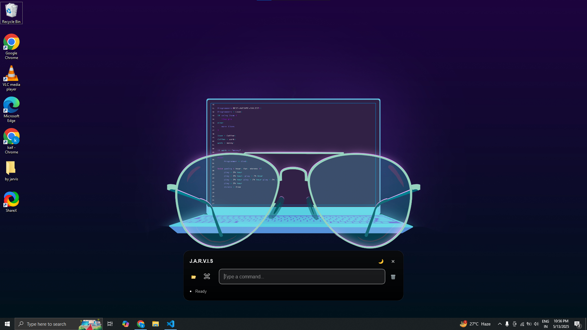
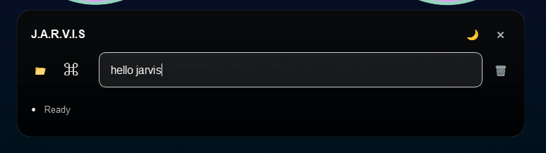
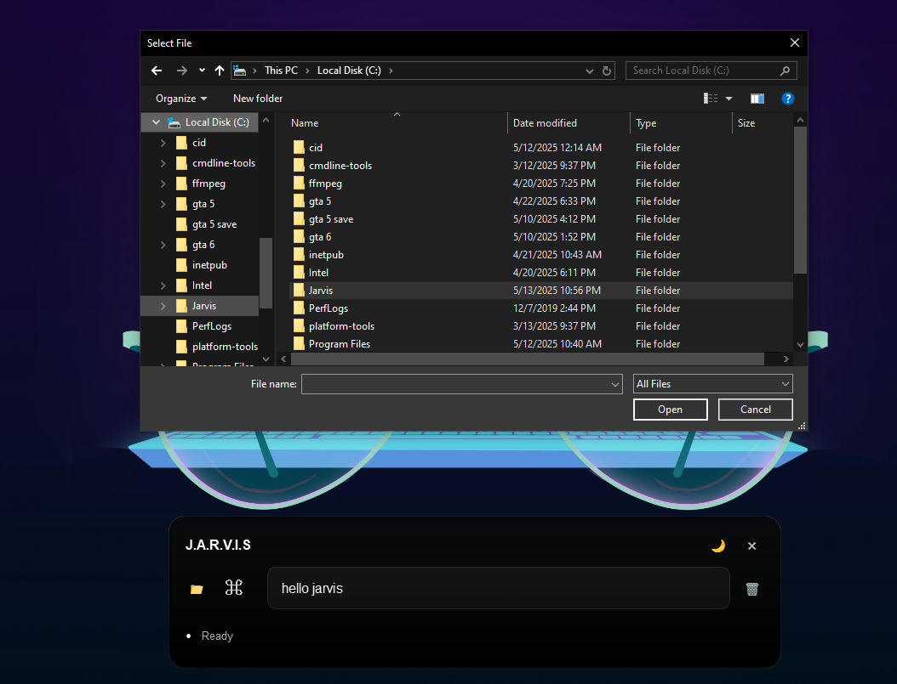
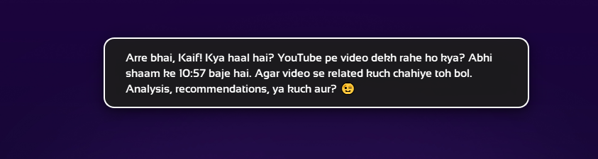
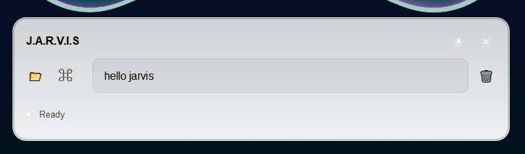
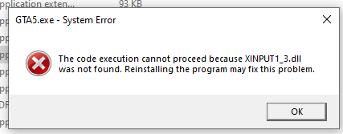
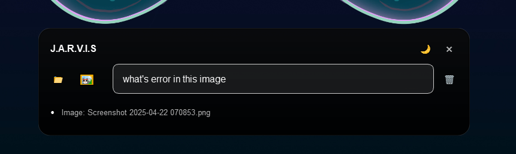
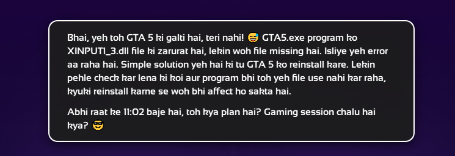
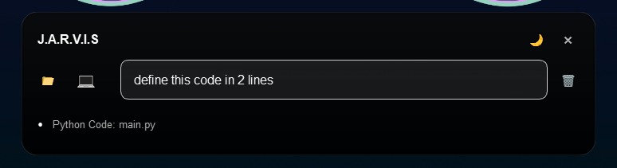

# JARVIS - AI Assistant for Windows

<p align="center">
  
  
  
  
  
</p>

<p align="center">
  <b>JARVIS: A voice-controlled AI assistant for Windows, inspired by Iron Man’s iconic companion, designed to enhance productivity through automation, media generation, system control, and context-aware conversations in English and Hinglish.</b>
</p>

---

## Overview

**JARVIS** ("Just A Rather Very Intelligent System") is an open-source AI assistant tailored for Windows. Inspired by *Iron Man*, it leverages speech recognition, text-to-speech, and advanced APIs to deliver a seamless, voice-activated experience. Ideal for developers, students, and professionals, JARVIS streamlines workflows with automation and engaging, culturally relevant conversations.

---

## Key Features

### Voice Interaction & Automation
- Control applications, windows, and system settings with voice commands.
- Generate media, including images and YouTube content, on demand.
- Execute system utilities like clearing temporary files or adjusting brightness.

### Conversational AI
- **Personalized Responses**: Tailored to user profiles and preferences.
- **Context Awareness**: Adapts responses based on time, location, and interaction history.
- **Hinglish Tone**: Combines English and Hindi for relatable, desi-style communication.
- **Memory System**: Retains user goals, facts, and moods for smarter interactions.

<details>
<summary><b>Conversational Features</b></summary>

| Feature                   | Description                                                                 |
|---------------------------|-----------------------------------------------------------------------------|
| Personalized Responses     | Custom replies using user data (e.g., name, preferences).                   |
| Context Awareness         | Considers time, location, and history for relevant responses.               |
| Memory System             | Stores and recalls user preferences, goals, and facts.                      |
| Hinglish Tone             | Engaging blend of English and Hindi for a desi vibe.                        |
| Proactive Suggestions      | Offers task reminders or ideas based on user goals.                         |
| Emotional Intelligence    | Adapts tone to user mood for empathetic interactions.                       |
| Vector Embeddings         | Powers context retrieval using Cohere’s embedding technology.               |

</details>

---

## Demo Screenshots

<details>
<summary><b>JARVIS Demo with Screenshots</b></summary>

### Main Interface
  
*Minimalist input bar with a glowing accent for voice or text commands, featuring a modern dark-themed UI.*

### Example Hello Command
  
*Demonstrates JARVIS responding to a "hello" command.*

### Dynamic Popup Response & Drag & Drop
  
*Showcases application launching with a responsive overlay and drag-and-drop support.*

### File Chooser Menu
  
*Clean, organized file chooser menu with fluid navigation.*

### Dark & Light Mode Toggle
  
*Customizable UI with dark and light mode options for accessibility.*

### Image Classification
  
*Input image analyzed with high accuracy.*  
  
*Prompt interface for image classification.*  
  
*Detailed, contextually relevant classification results.*  
  
*Secondary response with comprehensive insights.*

### Coding Assistant
  
*Real-time code suggestions within an integrated interface.*  
  
*Actionable code suggestions with clear explanations.*  
  
*Additional coding support with alternative solutions.*

</details>

---

## Automation Commands

<details>
<summary><b>Available Commands</b></summary>

| Command                   | Description                                          |
|---------------------------|------------------------------------------------------|
| Code helper               | Provides coding assistance via OpenRouter API.       |
| Create image              | Generates images using Cohere API (Flux model).      |
| Screenshot                | Captures the current screen.                         |
| Open [app]                | Launches applications (e.g., "Open Chrome").         |
| Close [app]               | Closes applications (e.g., "Close Chrome").          |
| Shutdown PC               | Powers down the computer.                            |
| Play on YouTube           | Streams YouTube videos.                               |
| Control brightness        | Adjusts screen brightness.                           |

</details>

---

## Installation

### Prerequisites
- **OS**: Windows 10/11 (64-bit)
- **Python**: 3.9 or higher
- **Git**: For cloning the repository
- **Microphone**: For voice commands
- **API Keys**: Together API, OpenRouter API, Cohere API

### Setup Steps
1. **Clone the Repository**:
   ```bash
   git clone https://github.com/CodedByKAns/Project-JARVIS.git
   cd Project-JARVIS
   ```
2. **Create a Virtual Environment**:
   ```bash
   python -m venv venv
   venv\Scripts\activate
   ```
3. **Install Dependencies**:
   ```bash
   pip install -r requirements.txt
   ```
4. **Configure API Keys**:
   - Create a `.env` file in the project root:
     ```env
     TOGETHER_API_KEY=your_together_api_key
     OPENROUTER_API_KEY=your_openrouter_api_key
     COHERE_API_KEY=your_cohere_api_key
     ```
5. **Launch JARVIS**:
   ```bash
   python main.py
   ```

---

## Usage

Activate JARVIS with **Ctrl + Shift + J**. Use natural voice or text commands, such as:
- "Code helper: Write a Python loop."
- "Create image: Make a sunset painting."
- "Shutdown PC" to power off.
- "Play on YouTube: Play 'Despacito'."

JARVIS responds with voice output and a sleek popup interface.

---

## Tech Stack

- **Speech Recognition**: `pyttsx3`
- **Text-to-Speech**: `edge_tts`
- **Vision**: Together API
- **Code Support**: OpenRouter API
- **Image Creation**: Cohere API (Flux model)
- **Interface**: Dynamic popup triggered by Ctrl + Shift + J

---

## How It Works

1. **Voice Capture**: `pyttsx3` converts speech to text.
2. **Command Matching**: Maps input to predefined actions or API calls.
3. **Execution**: Performs tasks or retrieves data via APIs.
4. **Output**: Delivers voice responses via `edge_tts` and displays a popup.

---

## Contributing

Contributions are welcome! To get started:
1. Fork the repository.
2. Create a feature branch: `git checkout -b feature/your-idea`.
3. Commit changes: `git commit -m "Added feature"`.
4. Push to the branch: `git push origin feature/your-idea`.
5. Submit a pull request.

---

## License

This project is licensed under the <a href="LICENSE" target="_blank">MIT License</a>.

---

## Contact

- **Author**: Kaif Ansari
- **GitHub**: <a href="https://github.com/CodedByKAns" target="_blank">CodedByKAns</a>
- **Email**: <a href="mailto:kaifansaridev@gmail.com" target="_blank">kaifansaridev@gmail.com</a>

---

<p align="center">
  <b>JARVIS: Your smart, desi AI companion for an enhanced Windows experience.</b><br>
  <i>Actively evolving—stay tuned for new features!</i>
</p>
```

### Testing
When this README is rendered on a platform supporting HTML (e.g., GitHub Pages or a custom Markdown renderer), all links will open in new tabs due to `target="_blank"`. On GitHub itself, the `LICENSE` link (relative) may open in the same tab unless GitHub’s UI overrides it, but external links (GitHub profile, email) will open in new tabs.

If you need further tweaks or want to handle links differently (e.g., for specific platforms), let me know!
