# 🤖 JARVIS - AI Assistant for Windows

<p align="center">
  
  
  
  
  
</p>

<p align="center">
  <b>JARVIS: A cutting-edge, voice-controlled AI assistant for Windows, designed to boost productivity for developers, students, and professionals by automating tasks, analyzing live screen content, generating media, and delivering context-aware responses—your very own Iron Man-inspired companion.</b>
</p>

---

## 🧠 Overview

**JARVIS** ("Just A Rather Very Intelligent System") is a highly customizable, open-source AI assistant tailored for Windows environments. Drawing inspiration from Tony Stark’s iconic assistant in the *Iron Man* series, JARVIS combines advanced natural language processing, computer vision, and hardware integration to deliver a seamless, futuristic user experience. It’s built to simplify workflows, enhance productivity, and make technology more accessible through intuitive voice commands.

### 🎯 Purpose
JARVIS aims to empower users by automating repetitive tasks, providing intelligent insights, and enabling hands-free control of both software and hardware. Whether you're a developer streamlining your coding environment, a student organizing study materials, or a professional managing daily tasks, JARVIS adapts to your needs with precision and efficiency.

### 🌟 Key Capabilities
- **Voice-Driven Interaction**: Execute commands hands-free using natural language, powered by Cohere Command R+.
- **Desktop Automation**: Launch, manage, or close applications with simple voice instructions.
- **AI-Powered Search**: Locate files, apps, or web content using semantic search with Whoosh and Cohere embeddings.
- **Hardware Integration**: Control AC appliances (e.g., lights, fans) via Arduino with safe optocoupler-based circuits.
- **Computer Vision**: Analyze live screen content or camera input using llama-3-2-11b for object detection, text recognition, and more.
- **Media Generation**: Create images or retrieve media (e.g., YouTube trailers) on demand.
- **Context-Aware Responses**: Engage in natural, conversational dialogues with human-like understanding.
- **Cross-Platform Potential**: Planned mobile app integration for remote control (roadmap feature).

---

## 🏗️ System Architecture

JARVIS is built on a modular, scalable architecture to ensure flexibility, maintainability, and performance. Below is an overview of its core components and workflow.

### 🛠️ Core Components
1. **Speech Recognizer**: Captures voice input and converts it to text using `SpeechRecognition`.
2. **NLP Engine**: Interprets user intent with Cohere Command R+ for online processing and a lightweight local model for offline tasks.
3. **Intent Detector**: Maps interpreted commands to specific actions (e.g., file search, app launch, or hardware control).
4. **Execution Modules**: Handle tasks like automation, file indexing, or vision processing.
5. **Text-to-Speech (TTS)**: Converts responses to natural-sounding speech using `edge_tts` or cloud-based TTS APIs.
6. **OS Interface**: Interacts with Windows APIs for automation via `pywin32` and `pyautogui`.
7. **Computer Vision Module**: Processes visual data screen llama-3-2-11b for real-time analysis.
8. **Hardware Interface**: Communicates with Arduino for appliance control using `pySerial`.

### 📈 Workflow Diagram

```mermaid
graph TD
    A[🎤 User Voice Input] -->|Captured| B[Speech Recognizer]
    B -->|Text| C[Cohere Command R+ NLP]
    C -->|Intent| D[Intent Detector]
    D -->|Action| E[Execution Modules]
    E -->|Automation| F[Windows OS Interface]
    E -->|Vision| G[llama-3-2-11b]
    E -->|Hardware| H[Arduino Controller]
    E -->|Response| I[Text-to-Speech]
    I -->|🔊 Voice Output| J[User]
    F -->|Feedback| I
    G -->|Results| I
    H -->|Status| I
```


### 🔄 Data Flow
1. Voice input is converted to text by the Speech Recognizer.
2. The NLP Engine processes the text to extract intent and context.
3. The Intent Detector routes the command to the appropriate module.
4. Execution Modules perform the task (e.g., launching an app, toggling a light, or analyzing a screenshot).
5. The TTS module delivers a spoken response, with optional visual feedback via a GUI.

---

## 🚀 Features

JARVIS offers a comprehensive suite of features to enhance productivity and user experience:

- **🎙️ Voice Command Execution**: Control your PC hands-free with natural language commands.
- **🔍 Semantic File & App Search**: Find files, apps, or online content using AI-driven semantic matching.
- **🪟 Desktop Automation**: Automate repetitive tasks like opening apps, switching windows, or managing workflows.
- **🎛️ Smart Home Integration**: Control AC appliances (lights, fans, etc.) via Arduino with TRIAC and optocoupler circuits.
- **🧠 Hybrid NLP Processing**: Combines offline processing for low latency with cloud-based NLP for complex queries.
- **🖥️ Vision Capabilities**: Perform real-time screen analysis, object detection, or text extraction using llama-3-2-11b.
- **🎨 Media Generation**: Generate images or fetch media (e.g., trailers, tutorials) with voice commands.
- **📱 Mobile App Support (Planned)**: Control JARVIS remotely via a mobile app (Q2 2025 roadmap).
- **💬 Conversational AI**: Engage in dynamic, context-aware conversations with natural responses.
- **🔒 Privacy-First Design**: Local processing for sensitive tasks, with optional cloud integration.

---

## ⚙️ Installation Guide

Follow these steps to set up JARVIS on your Windows system.

### 📋 Prerequisites
- **Operating System**: Windows 10 or 11 (64-bit)
- **Python**: Version 3.10 or higher
- **Git**: For cloning the repository
- **Microphone**: For voice input (built-in or external)
- **Arduino**: For hardware control (optional, e.g., Arduino Uno)
- **Internet Connection**: For cloud-based NLP and media features
- **Dependencies**: Listed in `requirements.txt`

### 🛠️ Installation Steps
1. **Clone the Repository**:
   ```bash
   git clone https://github.com/kaif-ansari-jarvis/JARVIS.git
   cd JARVIS
   ```
2. **Set Up a Virtual Environment** (recommended):
   ```bash
   python -m venv venv
   source venv/Scripts/activate  # Windows
   ```
3. **Install Dependencies**:
   ```bash
   pip install -r requirements.txt
   ```
4. **Configure API Keys**:
   - Create a `.env` file in the project root.
   - Add your Cohere API key for NLP features:
     ```env
     COHERE_API_KEY=your_api_key_here
     ```
5. **(Optional) Hardware Setup**:
   - Connect an Arduino to your PC via USB.
   - Upload the provided Arduino sketch (`arduino_control.ino`) to your board.
   - Ensure optocouplers and TRIACs are properly wired for safe AC appliance control.
6. **Run JARVIS**:
   ```bash
   python main.py
   ```

### ⚠️ Notes
- Ensure your microphone is configured correctly in Windows settings.
- For hardware control, follow safety guidelines when working with AC circuits.
- Check the [troubleshooting guide](docs/TROUBLESHOOTING.md) for common issues.

---

## 🧪 Sample Commands

Explore JARVIS’s capabilities with these example voice commands:

| **Voice Command**                     | **Action**                                          |
|---------------------------------------|----------------------------------------------------|
| "Open Visual Studio Code"            | Launches VS Code                                   |
| "Find my project proposal"           | Searches and opens the specified file              |
| "Turn on the living room light"      | Activates the light via Arduino                   |
| "What’s the weather today?"          | Fetches and speaks the current weather            |
| "Play the latest movie trailer"      | Searches and plays a trailer from YouTube         |
| "Set a timer for 10 minutes"         | Starts a countdown timer                          |
| "Take a screenshot and analyze it"   | Captures the screen and describes its contents    |
| "Generate an image of a futuristic city" | Creates an AI-generated image                  |

---

## 🛠️ Technology Stack

JARVIS is built with a robust, modern tech stack:

- **Programming Language**: Python 3.10+ for flexibility and ecosystem support
- **Speech Processing**:
  - `SpeechRecognition`: Voice-to-text conversion
  - `pyttsx3`: Offline text-to-speech
- **Natural Language Processing**:
  - Cohere Command R+: Cloud-based NLP for intent detection
  - Local NLP model (e.g., spaCy) for offline processing
- **Computer Vision**:
  - llama-3-2-11b
- **Automation**:
  - `pywin32`: Windows API integration
  - `pyautogui`: Cross-platform GUI automation
- **Search**:
  - Whoosh: Local file indexing and semantic search
  - Cohere Embeddings: Semantic web search
- **Hardware**:
  - Arduino: Microcontroller for appliance control
  - `pySerial`: Serial communication with Arduino
- **Web Framework**:
  - Flask: Lightweight server for optional GUI
- **Frontend (Optional)**:
  - Tkinter or PyQt5: Basic GUI for non-voice interaction
- **Environment Management**:
  - `python-dotenv`: Secure API key management

---

## 🔍 How It Works

JARVIS processes commands in a streamlined, multi-step pipeline:

1. **Voice Input**: The user speaks a command, captured by the microphone and converted to text via `SpeechRecognition`.
2. **Intent Analysis**: The text is processed by Cohere Command R+ (or a local NLP model) to determine the user’s intent.
3. **Action Routing**: The Intent Detector selects the appropriate module (e.g., automation, vision, or hardware control).
4. **Task Execution**:
   - Software tasks (e.g., app launch) use Windows APIs or `pyautogui`.
   - Hardware tasks send signals to Arduino via `pySerial`.
   - Vision tasks process camera or screen input with llama-3-2-11b.
5. **Response Delivery**: The TTS module generates a spoken response, with optional GUI or visual feedback.

### 🛠️ Hardware Control
For AC appliance control, JARVIS interfaces with an Arduino, which uses optocouplers and TRIACs to safely switch high-voltage devices. The circuit design ensures electrical isolation for user safety.

### 🖥️ Vision Processing
The vision module captures live screen or camera input, processes it with llama-3-2-11b for tasks like object detection or text extraction. Example: "Analyze my screen" triggers a screenshot and content description.

---

## 📋 Use Cases

JARVIS is versatile and caters to a wide range of users:

- **Developers**:
  - Automate IDE launches, script execution, or documentation searches.
  - Monitor code output on-screen in real time.
- **Students**:
  - Organize study materials, set reminders, or control room lighting.
  - Summarize lecture slides via screen analysis.
- **Professionals**:
  - Manage emails, schedules, or presentations with voice commands.
  - Automate repetitive office tasks.
- **Home Automation Enthusiasts**:
  - Control lights, fans, or other appliances hands-free.
  - Integrate with smart home ecosystems (future feature).
- **Accessibility**:
  - Enable hands-free computing for users with mobility challenges.
  - Provide audio-based feedback for visually impaired users.

---

## 🚨 Important Notes

- **YouTube Downloads**: JARVIS can fetch YouTube content (e.g., trailers) for **personal, non-commercial use only**. Always comply with YouTube’s [Terms of Service](https://www.youtube.com/tos) and respect copyright laws.
- **Hardware Safety**: When using Arduino for AC appliance control, ensure proper circuit design and professional installation to avoid electrical hazards.
- **Privacy**: JARVIS prioritizes local processing for sensitive tasks. Cloud-based features (e.g., Cohere NLP) are optional and require explicit user consent.

**Disclaimer**: JARVIS is an educational and experimental project. Use it responsibly and respect intellectual property and safety guidelines.

---

## 🤝 Contributing

We welcome contributions from the community! To contribute:

1. **Fork the Repository**:
   ```bash
   git fork https://github.com/kaif-ansari-jarvis/JARVIS.git
   ```
2. **Create a Feature Branch**:
   ```bash
   git checkout -b feature/your-feature-name
   ```
3. **Commit Changes**:
   ```bash
   git commit -m "Add your feature description"
   ```
4. **Push to Your Fork**:
   ```bash
   git push origin feature/your-feature-name
   ```
5. **Submit a Pull Request**: Open a PR on the main repository with a clear description of your changes.

Please adhere to the [Contributor Guidelines](CONTRIBUTING.md) and [Code of Conduct](CODE_OF_CONDUCT.md).

---

## 📄 License

JARVIS is licensed under the [MIT License](LICENSE). See the [LICENSE](LICENSE) file for details.

---

## 📅 Roadmap

Future enhancements planned for JARVIS:
- **Q2 2025**: Mobile app for remote control.
- **Q3 2025**: Integration with smart home platforms (e.g., Home Assistant).
- **Q4 2025**: Enhanced vision features with real-time video analysis.
- **TBD**: Support for additional OS platforms (Linux, macOS).

---

## 🙋‍♂️ Author

Developed with ❤️ by [Kaif Ansari](https://github.com/kaif-ansari-jarvis).

### 📬 Contact
- **GitHub**: [kaif-ansari-jarvis](https://github.com/kaif-ansari-jarvis)
- **Email**: kaif.ansari@example.com
- **Portfolio**: [kaifansari.dev](https://kaifansari.dev)

---

## 🙏 Acknowledgments

- **Cohere**: For powering advanced NLP capabilities.
- **llama-3-2-11b Community**: For robust computer vision tools.
- **Arduino Community**: For enabling hardware integration.
- **Contributors**: Thanks to all who have provided feedback and code contributions.

---

<p align="center">
  <b>Transform your workflow with JARVIS—your personal AI assistant, inspired by Iron Man, built for the real world.</b>
</p>
